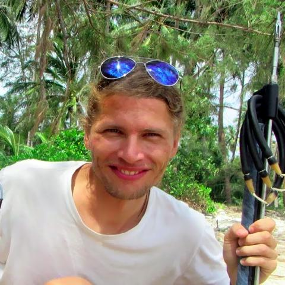

## as SoCs software developer experience

### [miZy](https://github.com/hyphop/miZy)
**2017-NOW** as founder and main developer

+ creator of [miZy](https://github.com/hyphop/miZy) (OS fully based on linux and other opensource software, optimized for embedded usage)
+ full stack developer ( c shell sh perl make gcc musl compilation cross-compilation git )
+ build dev-kit for developers
+ on demand custom firmware builder

### [Xunlong Orange PI](http://www.orangepi.org/index.html)
**2015-2018** as remote community  

+ work with H2+ H3 Soc's ()
+ active testing all boards
+ make improve Linux kernel support for all sunxi specific systems 
+ make improve U-boot support - for spi flash, i2c display, FEL mode, advanced linux boot 
+ prepare fully spi flash support, im was first who create Linux fully suitable for spi flash on sunxi boards https://openwrt.org/toh/xunlong/orangepizero

linux kernel + modules + u-boot infrastructure developer ( ** c shell perl make gcc musl arm compilation cross-compilation git **)
basic linux environment usage

work with rk3399 soc 

+ active testing
+ improve linux + uboot + dtb support for orange pi rk3399
+ create extreme small rescue system based on linux kernel uboot and busybox suitable for boot from any sources

work with full range allwinner h2+ h3 socs

### [HardKernel](https://www.hardkernel.com) 
**2015-2016** as remote community  

+ odroid c1 c2 
+ testing compilation linux, uboot, and other open source apps for this boards  
+ make a simple firmware image write/reader/checker and many other shell scripts collection for this boards 

### [OpenWRT](https://openwrt.org)
**2013-2018** as remote community

+ active developer for Atherous AR71xx/AR7240 MediaTek / Ralink - CPUs/SoCs, about 6 year
+ advanced and custom WiFi routers firmware builder, last 3 years

## active open source tester and contributor
**2010-NOW** as open source tester and contributor

+ ffmpeg, mpd , opus, flac, vorbis, icecast ...
+ improve linux kernel for many ARM SoCs boards ... 

check via google sources tagged by [##hyphop##](https://www.google.com/search?q=%23%23+hyphop+%23%23)
or there https://hyphop.github.io or https://github.com/hyphop or https://stackoverflow.com/cv/hyphop or https://stackoverflow.com/story/hyphop ...

# my contacts

* Name: Artem Lapkin
* Location: Moscow RUSSIA / Bangkok THAILAND
* Phone: ***********
* Email: mizy.linux(at)gmail(dot)com
* web: [http://hyphop.github.io](http://hyphop.github.io)
* CV: [http://hyphop.github.io/cv](http://hyphop.github.io/cv)
* GitHub: [http://github.com/hyphop](http://github.com/hyphop)
* PDF: [hyphop_cv.pdf](http://hyphop.github.io/cv/hyphop_cv.pdf)

